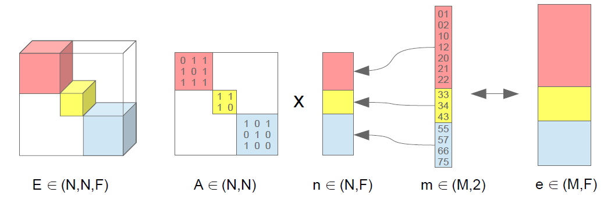

# Keras Graph Convolutions

A set of layers for graph convolutions in tensorflow keras.

# Table of Contents
* [General](#general)
* [Installation](#installation)
* [Implementation details](#implementation-details)
* [Literature](#literature)
* [Datasets](#datasets)
* [Examples](#examples)
* [Tests](#tests)
 

<a name="general"></a>
# General

The package in [kgcnn](kgcnn) contains several layer classes to build up graph convolution models. 
Some models are given as an example.
A documentation is generated in [docs](docs).
This repo is still under construction.
!! Any comments, suggestions or help are very welcome !! 

<a name="installation"></a>
# Installation

Clone repository and install with editable mode:

```bash
pip install -e ./gcnn_keras
```

<a name="implementation-details"></a>
# Implementation details

### Representation
The most frequent usage for graph convolutions are either node or graph classifaction. As for their size, either a single large graph, e.g. citation network or small (batched) graphs like molecules have to be considered. 
Graphs can be represented by a connection table plus feature information. Typical quantities in tensorform to describe a graph are listed below.

* `n`: Nodelist of shape `([batch],N,F)` where `N` is the number of nodes and `F` is the node feature dimension.
* `e`: Edgelist of shape `([batch],M,Fe)` where `M` is the number of edges and `Fe` is the edge feature dimension.
* `m`: Connectionlist of shape `([batch],M,2)` where `M` is the number of edges. The values denote a connection of incoming i and outgoing j node as `(i,j)`.
* `A`: Adjacency matrix of shape `([batch],N,N)` where `N` is the number of nodes. A connection is marked by 1 and 0 otherwise. 
* `E`: Edgefeature matrix of shape `([batch],N,N,Fe)` where `N` is the number of nodes and `Fe` is the edge feature dimension. Only entries that have `A(i,j) not 0` are meaningful.
 
A major issue for graphs is their flexible size and shape, when using mini-batches. Most graph implementations use a disjoint representation within a single graph. 
As a result, the batched subgraphs are converted into a larger graph which can be treated the same way as a single graph. 
However, for some layers, like e.g. pooling layers the division into subgraphs has to be treated explicitly and is commonly solved by a subgraph id-tensor of the former batch assignment.
The figure below shows the idea of disjoint subgraphs. 



Here, a set of conversion layers in [disjoint](kgcnn/layers/disjoint) are used to map a batched input into a disjoint subgraph representation. Note: The same convolution layers can also be used for a single large graph. 
The graph tensors, which are passed between layers, then do not have a batch dimension anymore and must treated with care when using standard keras layers. This is the primary way of using graph convolutions.

Nonetheless, batched representations, which are kept between keras layers via ragged, sparse, padded+mask tensors, are still investigated in [ragged](kgcnn/layers/ragged) and [padded](kgcnn/layers/padded) with some pros and cons depending on the situation. 


### Input

In order to input batched tensors of variable length with keras, either zero-padding plus masking or ragged and sparse tensors can be used. 
Depending on the task those representations can be combined by casting from one to the other.
Morover for more flexibility, a dataloader from `tf.keras.utils.Sequence` is often used. 
Here, the following input forms are listed. Tools for converting numpy or scipy arrays are found in [utils](kgcnn/data/utils.py)

* Ragged Tensor:
Here the nodelist of shape `(batch,None,F)` and edgelist of shape `(batch,None,Fe)` are given by ragged tensors with ragged dimension `(None,)`.
The graph structure is represented by an indexlist of shape `(batch,None,2)` with index of incoming `i` and outgoing `j` node as `(i,j)`. 
The first index of incoming node `i` is expected to be sorted for faster pooling opertions. Furthermore the graph is directed, so an additional edge with `(j,i)` is required for undirected graphs.
In principle also the adjacency matrix can be represented as ragged tensor of shape `(batch,None,None)` but will be dense within each graph.

* Padded Tensor:
The node- and edgelists are given by a full-rank tensor of shape `(batch,N,F)` with `N` or `M` being the maximum number of edges or nodes in the dataset, 
by padding all unused entries with zero and marking them in an additional mask tensor of same shape `(batch,N)`. 
This is only practical for highly connected graphs of similar shapes. 
Besides the adjacencymatrix also the index list can be arranged in a matrix form with a max number of edges for faster node pooling, e.g. `(batch,N,L)` with number of nodes `N` and edges per Node `L`.

<a name="literature"></a>
# Literature
The version of the following models are implemented in [literature](kgcnn/literature):
* **[INorp](kgcnn/literature/INorp.py)**: [Interaction Networks for Learning about Objects,Relations and Physics](http://papers.nips.cc/paper/6417-interaction-networks-for-learning-about-objects-relations-and-physics) by Battaglia et al. (2016)
* **[Megnet](kgcnn/literature/Megnet.py)**: [Graph Networks as a Universal Machine Learning Framework for Molecules and Crystals](https://doi.org/10.1021/acs.chemmater.9b01294) by Chen et al. (2019)
* **[NMPN](kgcnn/literature/NMPN.py)**: [Neural Message Passing for Quantum Chemistry](http://arxiv.org/abs/1704.01212) by Gilmer et al. (2017)
* **[Schnet](kgcnn/literature/Schnet.py)**: [SchNet – A deep learning architecture for molecules and materials ](https://aip.scitation.org/doi/10.1063/1.5019779) by Schütt et al. (2017)


<a name="datasets"></a>
# Datasets

In [data](kgcnn/data) there are simple file handling classes

<a name="examples"></a>
# Examples

A set of example traing can be found in [example](examples)
