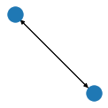

Data
====

There are some data classes in ``kgcnn`` that can help to store and load
graph data. In principle a graph is a collection of the follwing objects
in tensor-form:

-  ``nodes_attributes``: Node features of shape ``(N, F)`` where N is
   the number of nodes and F is the node feature dimension.
-  ``edge_indices``: Connection list of shape ``(M, 2)`` where M is the
   number of edges. The indices denote a connection of incoming or
   receiving node ``i`` and outgoing or sending node ``j`` as
   ``(i, j)``.
-  ``edges_attributes``: Edge features of shape ``(M, F)`` where M is
   the number of edges and F is the edge feature dimension.
-  ``graph_attributes``: Graph state information of shape ``(F, )``
   where F denotes the feature dimension.

These can be stored in form of numpy arrays in a dictionary type
container ``GraphDict``. Additional train/test assignment, labels,
positions/coordinates, forces or momentum, other connection indices or
even symbols or IDs can be added to this dictionary.

For multiple small graphs a list of these dictionaries serves to
represent the common case of datasets for supervised learning tasks, for
example small molecules or crystal structures.

Graph Dict
----------

Graphs are represented by a dictionary ``GraphDict`` of (numpy) arrays
which behaves like a python dict. In principle the ``GraphDict`` can
take every key and value pair via item operator ``[]``. However, for
consitency and class methods, keys must be names and values
``np.ndarray`` . You can use ``set`` and ``get`` to out-cast to numpy
arrays or run ``validate()``.

.. code:: ipython3

    import numpy as np
    from kgcnn.data.base import GraphDict
    # Single graph.
    graph = GraphDict({"edge_indices": np.array([[1, 0], [0, 1]]), "node_label":  np.array([[0], [1]])})
    graph.set("graph_labels",  np.array([0]))
    graph.set("edge_attributes", np.array([[1.0], [2.0]]));
    print({key: value.shape for key, value in graph.items()})
    print("Is dict: %s" % isinstance(graph, dict))
    print("Graph label", graph["graph_labels"])

.. parsed-literal::

    {'edge_indices': (2, 2), 'node_label': (2, 1), 'graph_labels': (1,), 'edge_attributes': (2, 1)}
    Is dict: True
    Graph label [0]
    

The class ``GraphDict`` can be converted to for example a strict graph
representation of ``networkx`` which keeps track of node and edge
changes.

.. code:: ipython3

    import networkx as nx
    import matplotlib.pyplot as plt
    nx_graph = graph.to_networkx()
    plt.figure(figsize=(1.5,1.5)) 
    nx.draw(nx_graph)
    plt.show()

Or compiling a dictionary of (tensorial) graph properties from a
``networkx`` graph.

.. code:: ipython3

    graph = GraphDict().from_networkx(nx.cubical_graph())
    print({key: value.shape for key, value in graph.items()})

.. parsed-literal::

    {'node_number': (8,), 'edge_indices': (12, 2)}
    

There are graph pre- and postprocessors in ``kgcnn.graph`` which take
specific properties by name and apply a processing function or
transformation. The processing function can for example compute angle
indices based on edges or sort edge indices and sort dependent features
accordingly.

   **WARNING**: However, they should be used with caution since they
   only apply to tensor properties regardless of any underlying graph.

For example ``SortEdgeIndices`` can sort an “edge_indices” tensor and
sort attributed properties such as “edge_attributes” or “edge_labels” or
a list of multiple (named) properties accordingly. In the example below
a generic search string is also valid. To directly update a
``GraphDict`` make a preprocessor with ``in_place=True`` . Note that
preprocessors can be serialised and habe a ``get_config`` method.

.. code:: ipython3

    from kgcnn.graph.preprocessor import SortEdgeIndices, AddEdgeSelfLoops, SetEdgeWeightsUniform
    
    SortEdgeIndices(edge_indices="edge_indices", edge_attributes="^edge_(?!indices$).*", in_place=True)(graph)
    
    SetEdgeWeightsUniform(edge_indices="edge_indices", value=1.0, in_place=True)(graph)
    
    AddEdgeSelfLoops(
        edge_indices="edge_indices", edge_attributes="^edge_(?!indices$).*", 
        remove_duplicates=True, sort_indices=True, fill_value=0, in_place=True)(graph);
    
    print({key: value.shape for key, value in graph.items()})

.. parsed-literal::

    {'node_number': (8,), 'edge_indices': (20, 2), 'edge_weights': (20, 1)}
    

Graph List
----------

A ``MemoryGraphList`` should behave identical to a python list but
contain only ``GraphDict`` items. Here a few examples with some utility
methods of the class.

.. code:: ipython3

    from kgcnn.data.base import MemoryGraphList
    
    # List of graph dicts.
    graph_list = MemoryGraphList([
        GraphDict({"edge_indices": [[0, 1], [1, 0]], "graph_label": [0]}), 
        GraphDict({"edge_indices": [[0, 0]], "graph_label": [1]}), 
        GraphDict({"graph_label": [0]})
    ])
    
    # Remove graphs without certain property
    graph_list.clean(["edge_indices"])
    print("New length of graph:", len(graph_list))
    
    # Go to every graph dict and take out the requested property. Opposite is set().
    print("Labels (list):", graph_list.get("graph_label"))
    
    # Or directly modify list.
    for i, x in enumerate(graph_list):
        x.set("graph_number", [i])
    
    print(graph_list)  # Also supports indexing lists.

.. parsed-literal::

    INFO:kgcnn.data.base:Property 'edge_indices' is not defined for graph '2'.
    WARNING:kgcnn.data.base:Found invalid graphs for properties. Removing graphs '[2]'.
    

.. parsed-literal::

    New length of graph: 2
    Labels (list): [array([0]), array([1])]
    <MemoryGraphList [{'edge_indices': array([[0, 1],
           [1, 0]]), 'graph_label': array([0]), 'graph_number': array([0])} ...]>
    

It is also easy to map a a method over the graph dicts in the list. This
can be a class method of ``GraphDict`` or a callable function (or class)
or for legacy compatibility a default name of a preprocessor.

.. code:: ipython3

    graph_list.map_list(method=AddEdgeSelfLoops(edge_indices="edge_indices", in_place=True))
    
    # Note: Former deprecated option is to use a method name that is looked up in the preprocessor class.
    # graph_list.map_list(method="add_edge_self_loops")

.. parsed-literal::

    <MemoryGraphList [{'edge_indices': array([[0, 0],
           [0, 1],
           [1, 0],
           [1, 1]]), 'graph_label': array([0]), 'graph_number': array([0])} ...]>

Most importantly is to obtain a ragged tensor for direct model input.
You can simply pass a list or dict of the config of keras Input layers
as shown below:

.. code:: ipython3

    graph_list.tensor([
        {"name": "edge_indices", "shape": (None, 2), "ragged": True, "dtype": "int64"},
        {"name": "graph_label", "shape": (1, ), "ragged": False}
    ])

.. parsed-literal::

    [<tf.RaggedTensor [[[0, 0],
       [0, 1],
       [1, 0],
       [1, 1]], [[0, 0]]]>,
     <tf.Tensor: shape=(2, 1), dtype=int32, numpy=
     array([[0],
            [1]])>]

Datasets
--------

The ``MemoryGraphDataset`` inherits from ``MemoryGraphList`` but must be
initialized with file information on disk that points to a
``data_directory`` for the dataset. The ``data_directory`` can have a
subdirectory for files and/or single file such as a CSV file. The usual
data structure looks like this:

.. code:: bash

   ├── data_directory
       ├── file_directory
       │   ├── *.*
       │   └── ... 
       ├── file_name
       └── dataset_name.kgcnn.pickle

.. code:: ipython3

    from kgcnn.data.base import MemoryGraphDataset
    dataset = MemoryGraphDataset(
        data_directory=".",  # Path to file directory or current folder
        dataset_name="Example",
        file_name=None, file_directory=None)
    
    # Modify like a MemoryGraphList
    for x in graph_list:
        dataset.append(x)
    dataset[0]["node_attributes"] = np.array([[0.9, 3.2], [1.2, 2.4]])
    print(dataset)

.. parsed-literal::

    <MemoryGraphDataset [{'edge_indices': array([[0, 0],
           [0, 1],
           [1, 0],
           [1, 1]]), 'graph_label': array([0]), 'graph_number': array([0]), 'node_attributes': array([[0.9, 3.2],
           [1.2, 2.4]])} ...]>
    

You can also change the location on file with ``relocate()`` . Note that
in this case only the file information is changed, but no files are
moved or copied. Save the dataset as pickled python list of python dicts
to file:

.. code:: ipython3

    dataset.save()
    dataset.load()

.. parsed-literal::

    INFO:kgcnn.data.Example:Pickle dataset...
    INFO:kgcnn.data.Example:Load pickled dataset...
    

.. parsed-literal::

    <MemoryGraphDataset [{'edge_indices': array([[0, 0],
           [0, 1],
           [1, 0],
           [1, 1]]), 'graph_label': array([0]), 'graph_number': array([0]), 'node_attributes': array([[0.9, 3.2],
           [1.2, 2.4]])} ...]>

Special Datasets
~~~~~~~~~~~~~~~~

From ``MemoryGraphDataset`` there are many subclasses ``QMDataset``,
``MoleculeNetDataset``, ``CrystalDataset``, ``VisualGraphDataset`` and
``GraphTUDataset`` which further have functions required for the
specific dataset type to convert and process files such as ‘.txt’,
‘.sdf’, ‘.xyz’, ‘.cif’, ‘.jpg’ etc. They are located in ``kgcnn.data`` .
Most subclasses implement ``prepare_data()`` and ``read_in_memory()``
with dataset dependent arguments to preprocess and finally load data
from different formats.

Then there are fully prepared subclasses in ``kgcnn.data.datasets``
which download and process common benchmark datasets and can be used as
simple as this:

.. code:: ipython3

    from kgcnn.data.datasets.MUTAGDataset import MUTAGDataset
    dataset = MUTAGDataset()  # inherits from GraphTUDataset2020()
    dataset[0].keys()

.. parsed-literal::

    INFO:kgcnn.data.download:Checking and possibly downloading dataset with name MUTAG
    INFO:kgcnn.data.download:Dataset directory located at C:\Users\patri\.kgcnn\datasets
    INFO:kgcnn.data.download:Dataset directory found. Done.
    INFO:kgcnn.data.download:Dataset found. Done.
    INFO:kgcnn.data.download:Directory for extraction exists. Done.
    INFO:kgcnn.data.download:Not extracting zip file. Stopped.
    INFO:kgcnn.data.MUTAG:Reading dataset to memory with name MUTAG
    INFO:kgcnn.data.MUTAG:Shift start of graph ID to zero for 'MUTAG' to match python indexing.
    INFO:kgcnn.data.MUTAG:Graph index which has unconnected '[]' with '[]' in total '0'.
    

.. parsed-literal::

    dict_keys(['node_degree', 'node_labels', 'edge_indices', 'edge_labels', 'graph_labels', 'node_attributes', 'edge_attributes', 'node_symbol', 'node_number', 'graph_size'])

Here are some examples on custom usage of the base classes:

MoleculeNetDatasets
^^^^^^^^^^^^^^^^^^^

   **note**: You can find this page as jupyter notebook in
   https://github.com/aimat-lab/gcnn_keras/tree/master/notebooks/docs .
