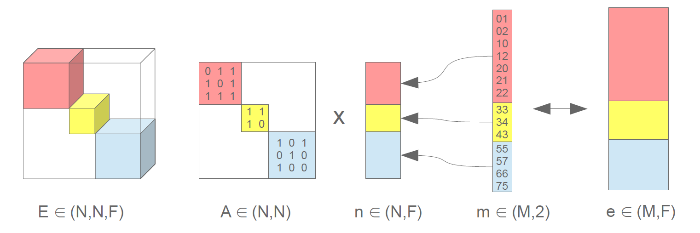

.. _intro:
   :maxdepth: 3

Introduction
============

The package in `kgcnn <https://github.com/aimat-lab/gcnn_keras/tree/master/kgcnn>`__ contains several layer classes to build up graph convolution models.
Some models are given as an example.

The version of **kgcnn>=4.0.0** are developed for **keras>=3.0** and should enable graph neural networks with multi-backend support.
The currently supported backends are `PyTorch <https://pytorch.org/>`__ , `TensorFlow <https://www.tensorflow.org/install>`__ and `Jax <https://jax.readthedocs.io/en/latest/installation.html>`__ .
For graph operations also some additional multi-backend functions are implemented within ``kgcnn.ops`` .

All models and layers of kgcnn essentially use the concept of disjoint graphs from `PyTorch Geometric <https://pytorch-geometric.readthedocs.io/en/latest/>`__ .
The graph convolutions are defined for a single graph that consists of smaller disjoint sub-graphs which represent the mini-batch, fore example
node aggregating with ``kgcnn.layers.aggr`` and convolutions with ``kgcnn.layers.conv`` .
Only for (global) pooling operations the batch information must be provided in example in form of a ID assignment tensor to pool each sub-graph separately with ``kgcnn.layers.pool`` .

Starting from a batched graphs, the indices `(i, j)` that define an edge between nodes must be shifted to match the sub-graph position.
This can be realized with dataloaders ``kgcnn.io.loader`` or casting layers ``kgcnn.layers.casting`` .
This means batched graphs from the typical format below are cast to a disjoint graph.

**Batched Graphs**

* ``node_attr``: Node attributes of shape `(batch, N, F)` and dtype *float*
* ``edge_attr``: Edge attributes of shape `(batch, M, F)` and dtype *float*
* ``edge_index``: Indices of shape `(batch, M, 2)` and dtype *int*
* ``graph_attr``: Graph attributes of shape `(batch, F)` and dtype *float*

Graphs are stacked along the batch dimension `batch`. Note that for flexible sized graphs the tensor has to be padded up to a max `N`/`M` or ragged tensors are used,
with a ragged rank of one.

**Disjoint Graph**

* ``node_attr``: Node attributes of shape `([N], F)` and dtype *float*
* ``edge_attr``: Edge attributes of shape `([M], F)` and dtype *float*
* ``edge_index``: Indices of shape `(2, [M])` and dtype *int*
* ``batch_ID``: Graph ID of shape `([N], )` and dtype *int*

Where there are nodes of multiple graphs within the total number of nodes per batch `[N]` .
To comform with PyG format the indices tuples `(i, j)` are at first dimension for ``edge_index`` .

A note on padded-disjoint graphs:

For jax all tensors should have fixed shape and ragged or flexible batch sizes is not desired.
Also for pooling and clustering graphs may change their nodes. The most simple way is to allow for a
`padded-disjoint` representation. Here, we simply add a dummy graph at the beginning with ID 0 and index and a single node and a single
self-loop edge and assign all padded or cropped nodes/edges to this graph, i.e. set it to index 0.
Data loaders will then decide for a max. disjoint graph size and then fill up with as many disjoint graphs as possible.
Also for padded batched graphs it is possible within kgcnn to cast to padded-disjoint graph but with a lot more memory and speed-performance loss.

